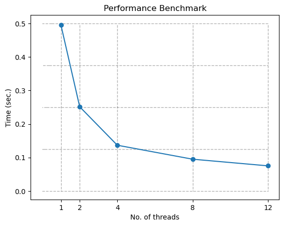

# High-Performance Computing

## Homework: Convert Color Image to Gray Image

Anand Kamble  
Department of Scientific Computing  
Florida State University  

---

## Objective

This project aims to parallelize a C++ program for converting color images to grayscale using OpenMP. The objective is to optimize execution speed by harnessing multi-core processors. The project will implement OpenMP directives, analyze performance with varying thread counts, and evaluate the scalability of the parallelized solution. The goal is to demonstrate the efficiency gains achieved through parallelization in image processing.

---

## Project Setup

We are using Visual Studio 2022 for this project. The given zip file includes everything needed to run this project. To make sure that the project is compiled correctly, we need to confirm that the following properties are updated. You will have to open project properties.

- Platform → **All Platforms** (To make sure that changes are applied to all platforms.)
- General → Windows SDK Version → **10.0 (latest installed version)**
- Platform Toolset → **Visual Studio 2022 (v143)**
- C/C++ → Language → Open MP Support → **Yes(/openmp)**

---

## Parallelization

We will be benchmarking the parallel region for multiple numbers of threads from 1 to 12.
The key line to parallelize the given code is as follows:

```cpp
#pragma omp parallel num_threads(t) default(none) private(col) shared(dataBuf, width, height)
```

This line defines a region of the program as a parallel region with given directives. The directives which we have provided are as follows:

- `num_threads(t)`: number of threads to be created for the parallel region. Where `t` is the number of threads.
- `default(none)`: Specify that no default data-sharing attributes should be assumed for any variables. This ensures that all variable scopes are explicitly defined.
- `firstprivate(col)`: This ensures that each thread has its own copy of `col` variable which is initialized with the value from the master thread.
- `shared(dataBuf, width, height)`: Specifies that `dataBuf`, `width`, and `height` are shared variables, meaning that all threads have access to the same memory locations.

---

## Bug Fixes

During parallelizing the program, a bug that was noticed was that some portions of the image were still colored. These portions were mostly horizontal lines in the image which were colored. This was happening due to not making the `col` variable private to each thread.

---

## Results

The parallelized RGB to gray luminance conversion was benchmarked across various thread counts, ranging from 1 to 12. As the number of threads increases, the time required for the image conversion process is expected to decrease, reflecting the potential efficiency gains achieved through concurrent execution.



The following figure shows the scalability of the program compared to the ideal speedup.


---


